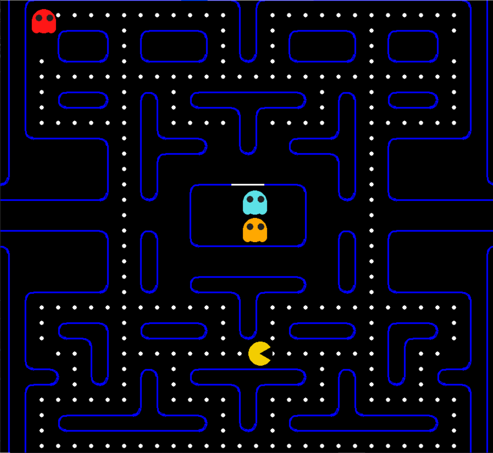

# Pac-Man Game in Python (Pygame)

## Overview

This project is a Pac-Man style arcade game developed in Python using the Pygame library. The game includes player movement, ghost AI behavior, collectible dots, power-ups, scoring, and a tile-based maze system.


## Features

* Player-controlled Pac-Man movement
* Multiple ghost enemies with different behaviors
* Dot and power pellet collection system
* Basic ghost AI (chasing and movement logic)
* Score tracking system
* Lives system
* Tile-based maze using custom board design
* Sprite-based rendering using image assets


## Technologies Used

* Python
* Pygame


## Project Structure

```text
pacman-python-game/
├── main.py              # Main game logic and loop
├── board.py             # Maze layout and tile definitions
├── requirements.txt     # Dependencies
├── README.md
├── .gitignore
├── assets/
│   ├── player_images/   # Pac-Man animation frames
│   ├── ghost_images/    # Ghost sprites
│   └── screenshots/     # Game screenshots
└── docs/
    └── sprite-reference.png
```

---

## How to Run

1. Clone the repository:

```bash
git clone https://github.com/mohamedarshad2/pacman-python-game.git
```

2. Navigate to the project folder:

```bash
cd pacman-python-game
```

3. Install dependencies:

```bash
pip install -r requirements.txt
```

4. Run the game:

```bash
python main.py
```

---

## Controls

* ⬅️➡️⬆️⬇️ Arrow keys to move Pac-Man

---

## 📷 Screenshots



---

## Key Files

* `main.py` → Handles game loop, movement, collision detection, scoring, and ghost logic
* `board.py` → Defines the maze layout using a tile-based system

---

## 🧠 What I Learned

* Game loop design and real-time rendering
* Handling user input and movement
* Collision detection and game state management
* Working with sprites and assets in Pygame
* Structuring a complete Python project

---

## 🔮 Future Improvements

* Add start menu and pause functionality
* Add sound effects and background music
* Implement multiple levels
* Improve ghost AI behavior
* Enhance UI/UX design

---

## 👨‍💻 Author

Mohamed Arshad
